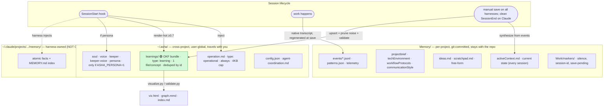

# Memory architecture

Asha's memory is the only thing that connects one session to the next — each
session starts with a blank model, so whatever persists has to live on disk. This
document maps what those stores are, how they're read and written, where the OKF
format fits, and — because the system is genuinely complex — **how to judge
whether it's earning its keep.**

## The three scopes

Memory splits into three stores with different owners and lifespans:



Plain-text reference:

```
MEMORY (3 scopes)
│
├─ ~/.asha/                 cross-project · read at SessionStart · follows you everywhere
│   ├─ operation.md         always · operational rules (4KB inject cap)
│   ├─ learnings/  ←──OKF── growing concept bundle, hot tier injected, deduped by id
│   ├─ soul/voice/keeper    persona · only with ASHA_PERSONA=1
│   └─ config.json
│
├─ Memory/                  per-project · git-committed · written at /save
│   ├─ activeContext.md     synthesized from events each session
│   ├─ projectbrief, techEnvironment, workflowProtocols, communicationStyle ...
│   ├─ ideas.md / scratchpad.md
│   └─ events/*.jsonl       telemetry the synthesis reads
│
└─ ~/.claude/projects/.../memory/   harness-owned · NOT OKF (we don't control its writer)
```

## How the pieces work together

Two ideas do most of the work: **scope** and **rhythm**.

**Scope.** `~/.asha/` is *who you are and what you've learned* — it rides with you
into every project. `Memory/` is *this project's state* — it's committed to the
repo and stays there. The native `~/.claude/...` store is a third, separate thing
the Claude Code harness manages on its own; Asha neither writes nor depends on it.

**Rhythm.** Memory is **read at the top of a session and consolidated at the end**:

- **SessionStart reads.** The hook injects `operation.md` + the learnings hot tier
  (`render-hot`, top ≤10 entries with Confidence ≥ 0.7, byte-budgeted), plus the
  persona files when `ASHA_PERSONA=1`.
- **The harness records.** Each harness owns its native transcript. At save time,
  Asha regenerates `Memory/events/*.jsonl` from that transcript. Copilot capture
  is partial for existing-file edits until a stable native schema is verified.
- **Manual `/save` writes on every harness.** `pattern_analyzer.py` synthesizes
  `activeContext.md` from the event log; `learnings_manager.py` upserts new
  learnings into the bundle; `save_guardrail.py` prunes noise; `validate.py` checks
  the bundle (warn-only); `Memory/` is committed.
- **Automatic clean-exit save is Claude-only.** Codex, Copilot, and OpenCode have
  no Asha SessionEnd lifecycle path and require manual save. A silence marker
  suppresses both explicit synthesis and Claude automatic save, and persists
  until explicitly disabled.
- **Global calibration is interactive policy.** Automatic save never writes
  `~/.asha/keeper.md` or `~/.asha/voice.md`. Explicit save can do so only when
  `capture_calibration` is true in `~/.asha/config.json`.

So the event log is the input, and `activeContext` + `learnings/` are the refined
outputs a future cold-start session actually reads.

## Where OKF fits (it's baked in, not a separate skill)

The [Open Knowledge Format](https://okf.md/spec/) applies to exactly one store —
the **learnings bundle** — because it's the only memory that's a *growing
collection of atomic concepts*, which is what the format is for. There is **no
standalone `/okf` skill**; OKF lives in three baked-in places in the session
plugin:

1. **Format** — `learnings_manager.py` writes OKF-conformant files directly
   (top-level `type`, markdown links, reserved `index.md`). It produces the shape;
   it has no dependency on the tooling below.
2. **Tooling** — `validate.py` / `visualize.py` / `okf_common.py` are vendored
   plain scripts in `plugins/session/tools/` (from `sniperunder123/okf-knowledge`,
   MIT). Called by the save pipeline (validate, warn-only) and on demand
   (visualize). Scripts, not skills.
3. **Convention** — documented in the existing `memory-maintenance` skill.

The bundle is also **cross-linked**: each learning may carry a `## Related` section
pointing to related concepts. Links are **auto-suggested at interactive `/save`**
(the session's Claude proposes genuine *semantic* links — never mere category
overlap — and applies them, non-blocking), and can be curated by hand via
`learnings_manager.py link` / `prune-links`. `visualize.py` renders the resulting
graph; links live in the body, so they add zero session-start injection cost.

Everything else (the Memory Bank files, the `~/.asha/` singletons, events/logs)
is *tagged* with a `type` but is **not** OKF-bundled — those are fixed state
documents or telemetry, not growing concept collections, so the format buys
nothing there.

## Is it providing value? (how to tell)

The memory system has real cost — context spent on injection every session, plus
maintenance — so it's fair to ask whether it pays for itself. It does **not**
always; here's how to judge for a given project.

**Signals it's working:**

- **Cold-start just works.** A fresh session reads `activeContext.md` + the hot
  tier and acts immediately — no re-exploring what the last session already
  figured out. This is the single biggest payoff. Test it: open a new session and
  see whether it picks up where you left off or flails.
- **Injected learnings change behavior.** A hot-tier learning fires and you avoid
  a known failure. Each learning's evidence log (`confirm`/`contradict` history
  across projects) shows whether it's actually being reinforced in practice.
- **Cross-project transfer.** A pattern learned in one repo helps in another —
  only the `~/.asha/` scope can do this.

**Signals it's waste (or worse, misleading):**

- **Generic `activeContext`.** A lead block of `Created N files` or a Next Steps of
  "Review and plan next session" actively misleads a cold-start. (The `/save`
  verification gate fights this; if you see it, the synthesis didn't earn its keep
  this session.)
- **Noise in the hot tier.** Tautological `sequence-*` / `prefer-*` learnings crowd
  the inject with content you'd never act on. (The guardrail prunes these; watch
  for new shapes of noise.)
- **You never read or act on what's injected.** If the hot tier scrolls past
  unread every session, it's pure context tax.

**Diagnostics you can run:**

```bash
T="$(jq -r .asha_root ~/.asha/config.json)/plugins/session/tools"
python3 $T/learnings_manager.py render-hot --max-bytes 3000   # exactly what gets injected — would you want a fresh you to know this?
python3 $T/learnings_manager.py list                          # categories + counts + avg confidence
python3 $T/learnings_manager.py query --min-confidence 0.7    # the hot set, ranked
python3 $T/validate.py ~/.asha/learnings --strict             # structural health
python3 $T/visualize.py ~/.asha/learnings                     # viz.html — see the shape
# and just read it:
sed -n '1,40p' Memory/activeContext.md                        # could a stranger act on this?
```

**When it's NOT worth it:** throwaway or pure-exploration work, one-off tasks, or
tiny projects where you already hold all the context. In those cases the capture
and synthesis are overhead with no cold-start to serve.

## Controls / tuning

| Lever | Effect |
|---|---|
| `/session:silence` (or `Work/markers/silence`) | Stop all capture + synthesis for throwaway work |
| Hot-tier threshold (Confidence ≥ 0.7) + cap (≤10) | Bounds what's injected; everything else stays cold in the bundle |
| `save_guardrail.py` | Prunes `sequence-*`/`prefer-*` noise at save time |
| `validate.py` (warn-only; `ASHA_LEARNINGS_VALIDATE=strict`) | Surfaces structural drift without blocking saves |
| `learnings_manager.py link` / auto-suggest at `/save` | Cross-links related concepts (`## Related`); builds the graph over time, non-blocking, zero inject cost |
| What's captured | Synthesis reads `Memory/events/*.jsonl`; less noise in → better signal out |

The guiding principle: **the hot tier is a budget, not an archive.** Keep what a
future session would genuinely act on; let confidence and the guardrail demote the
rest. If the injected content consistently isn't worth reading, that's the signal
to prune, raise the threshold, or silence the project — not to add more.
