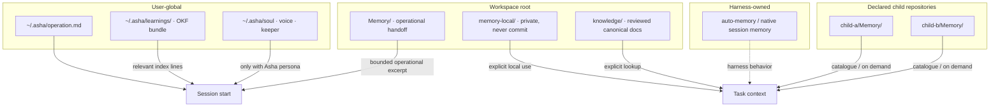

# Memory Architecture

Asha uses separate stores for separate ownership boundaries. The number of
directories is not accidental, but the distinction must remain legible:

- global memory follows the user;
- repository memory stays with one repository;
- workspace memory coordinates several repositories;
- private workspace material does not enter Git;
- canonical knowledge is published only after review; and
- harness-native memory remains outside Asha's control.

## The short version

| Store | Location | Scope | Writer | Read path |
|---|---|---|---|---|
| Global operation, identity, and learnings | `~/.asha/` | User across all work | Session synthesis plus deliberate edits | Operational index at SessionStart; bodies on demand; persona only through the Asha wrapper |
| Repository operational memory | `<repo>/Memory/` | One repository | `/session:save` synthesis and deliberate project updates | Project bootstrap, catalogue retrieval, and on demand |
| Workspace operational memory | `<workspace>/Memory/` | Declared repository group | Deliberate edits; `/session:save --scope workspace` routes its commit | Bounded SessionStart handoff plus catalogue retrieval |
| Private workspace memory | `<workspace>/memory-local/` | Local user within one workspace | Deliberate local work and work-item tooling | Explicit only; never injected wholesale |
| Canonical workspace knowledge | `<workspace>/knowledge/` | Shared/team workspace | Reviewed promotion | Explicit lookup from its indexes and documents |
| Harness-native memory | Harness-owned path | Harness-specific | The harness | The harness; Asha neither writes nor requires it |

The first five are Asha-managed or Asha-governed planes. The sixth is listed
only to prevent it being mistaken for another Asha store.

## Ownership map


```mermaid
flowchart TB
    subgraph GLOBAL["User-global"]
        OP["~/.asha/operation.md"]
        LR["~/.asha/learnings/ · OKF bundle"]
        ID["~/.asha/soul · voice · keeper"]
    end

    subgraph WORKSPACE["Workspace root"]
        WM["Memory/ · operational handoff"]
        ML["memory-local/ · private, never commit"]
        KN["knowledge/ · reviewed canonical docs"]
    end

    subgraph REPOS["Declared child repositories"]
        R1["child-a/Memory/"]
        R2["child-b/Memory/"]
    end

    subgraph NATIVE["Harness-owned"]
        HM["auto-memory / native session memory"]
    end

    LR -->|relevant index lines| START[Session start]
    OP --> START
    ID -->|only with Asha persona| START
    WM -->|bounded operational excerpt| START
    R1 -->|catalogue / on demand| TASK[Task context]
    R2 -->|catalogue / on demand| TASK
    KN -->|explicit lookup| TASK
    ML -->|explicit local use| TASK
    HM -.->|harness behavior| TASK
```

## What belongs where

### `~/.asha/`: global operation, identity, and learnings

Use this for information that should follow the user into unrelated projects.

| Path | Purpose |
|---|---|
| `operation.md` | Cross-project execution rules |
| `learnings/` | Confidence-tracked reusable patterns, one concept per file |
| `learnings-archive/` | Retired concepts removed from live retrieval |
| `soul.md`, `voice.md`, `keeper.md`, `keeper-voice.md` | Optional persona and partnership context |
| `config.json` | User-wide Asha configuration |

Do not place one repository's current branch, unfinished implementation, or
temporary paths here. Those belong to repository operational memory.

### `<repo>/Memory/`: repository operational memory

Use this for the cold-start handoff for one repository:

```text
Memory/
├── MEMORY.md              bounded catalogue when present
├── activeContext.md       current work and immediate next state
├── projectbrief.md        stable project purpose and constraints
├── techEnvironment.md     tools, commands, and platform facts
├── workflowProtocols.md   repository-specific procedures
└── events/                normalized synthesis input and telemetry
```

This plane is committed with its repository. A repository save must not stage
workspace-root memory or another child repository's files.

### `<workspace>/Memory/`: workspace operational memory

Use this for the small amount of current state that several child repositories
must share: cross-repository sequencing, active handoff, integration status, and
workspace-wide constraints.

It is not a second copy of every child repository's `Memory/`. Child-specific
implementation detail stays with the child.

SessionStart injects only a bounded excerpt of the workspace operational
handoff. The default renderer includes the workspace name, root, active child,
and the first `##` section of `Memory/activeContext.md`, capped by
`ASHA_WS_CONTEXT_MAX` (default 2,048 bytes; minimum 256).

Workspace memory is authored deliberately. `/session:save --scope workspace`
routes staging, commit, and optional push for that plane; it does not synthesize
a fictional workspace transcript.

### `<workspace>/memory-local/`: private workspace material

Use this for local notes, work-item records, imported private material, and
drafts that are not ready for shared review. Workspace initialization adds the
root to `.gitignore` and generated workspace instructions mark it never-commit.

This plane is not silently promoted, committed, or injected wholesale. A
promotion or import workflow must name its source and pass its own review gates.

### `<workspace>/knowledge/`: canonical shared knowledge

Use this for stable documentation that should be shared across the workspace:
repository indexes, cross-repository contracts, architecture facts, and
reviewed operational knowledge.

Canonical does not mean infallible. Live source, configuration, and runtime
state remain higher authority than documentation. When they conflict, correct
the document; do not alter live state merely to make an old note true.

Knowledge changes use the workspace promotion workflow:

```bash
asha workspace knowledge lint --start .
asha workspace promote plan --help
asha workspace promote apply --help
asha workspace promote publish --help
```

`plan` creates a digest-bound review artifact. `apply` revalidates the artifact,
source evidence, and target preimages before writing. In pull-request mode,
`publish` creates a dedicated branch and draft PR. It never merges or updates
the base branch.

### Harness-native memory

Claude and other harnesses may maintain their own memory stores. Those stores
are not an Asha plane, are not OKF-managed, and are not an Asha dependency.
Their contents and lifecycle are governed by the harness.

## Launch point decides task ownership

For one repository:

```bash
cd /path/to/repository
asha claude                    # or codex / copilot
```

For a workspace, launch from a declared child repository when that repository
owns the work:

```bash
cd /path/to/workspace/child-a
asha codex
```

Launch from the workspace root when the work is cross-repository or belongs to
the shared planes:

```bash
cd /path/to/workspace
asha codex
```

The manifest at `.asha/workspace.json` defines the declared repositories,
memory roots, shared Git root, and promotion mode. Detection walks upward from
the launch directory but stops before `$HOME` and the filesystem root.

## Save routing

```text
/session:save
/session:save --scope repo
/session:save --scope workspace
/session:save --scope none
```

| Context | Behavior |
|---|---|
| No workspace manifest + bare save | Existing single-repository synthesis and save |
| No workspace manifest + any `--scope` | Hard error; scope flags are workspace-only |
| Inside a declared child + bare save | Same as `--scope repo` |
| Inside a declared child + `--scope repo` | Synthesize and save only that child's repository memory |
| Workspace root + `--scope repo` | Hard error; there is no implicit child |
| Anywhere in workspace + `--scope workspace` | Save only the workspace operational plane |
| `--scope none` | Synthesize without staging, committing, or pushing |

`--no-push` commits the selected plane without pushing. Plane-specific proofs
and commit gates prevent a child save and workspace save being folded into one
unattributable commit.

Manual save works across Claude, Codex, Copilot, and OpenCode. Claude and
Copilot have clean-exit lifecycle hooks. OpenCode has best-effort clean-exit
save through plugin `dispose`; Codex requires manual save.

## Read rhythm

At session start:

1. `operation.md` is injected with its byte cap.
2. The learnings bundle is rendered index-first: one bounded line per concept,
   hot-first, with bodies read only when relevant.
3. Persona files are added only when launched through `asha <harness>`.
4. A valid workspace contributes one bounded operational-context block.
5. Repository and workspace catalogues remain available for targeted retrieval.

`ASHA_LEARNINGS_INJECT=hot` restores the legacy top-ten full-body learning
injection. `ASHA_WS_INJECT=0`, `Work/markers/nudge-ws-context-off`, or the
silence marker suppresses workspace injection.

The optional evidence broker remains bounded and read-only:

```bash
asha context brief "task description"
asha process route "task description"
asha capabilities match "task description"
```

It reads catalogue metadata rather than recursively scanning memory bodies.
See [Evidence-backed brokerage](evidence-backed-brokerage.md).

## Write rhythm

An explicit repository save:

1. reads the active harness transcript;
2. regenerates normalized `Memory/events/*.jsonl`;
3. synthesizes repository `Memory/activeContext.md`;
4. updates relevant `~/.asha/learnings/` concepts;
5. runs noise pruning, validation, and recall diagnostics; and
6. stages, commits, and pushes unless the selected flags say otherwise.

Automatic saves never alter `~/.asha/voice.md` or `~/.asha/keeper.md`. An
explicit save may capture calibration only when `capture_calibration` is true
in `~/.asha/config.json`.

`/session:consolidate` is the periodic reverse stroke: merge drifted concepts,
resolve contradictions against disk truth, retire concluded records, fold
approved calibration, and reduce index pressure. Run it when the injected index
reports omitted concepts or roughly monthly during active use.

## Where OKF fits

The [Open Knowledge Format](https://okf.md/spec/) applies to the global
`~/.asha/learnings/` bundle because it is the growing collection of atomic
concepts. There is no separate `/okf` skill.

1. `learnings_manager.py` writes the concept files and reserved index shape.
2. `validate.py`, `visualize.py`, and `okf_common.py` provide local tooling.
3. The `memory-maintenance` skill documents the conventions.

Interactive save may suggest semantic `## Related` links between recently
touched concepts. The links live in document bodies and therefore add no
SessionStart injection cost. Fixed state documents, workspace knowledge, and
telemetry may carry frontmatter but are not one OKF bundle by implication.

## Durability and privacy

- `~/.asha/learnings/` and `learnings-archive/` are local-only unless the user
  arranges backup. Include both when backing up identity files.
- Repository and workspace operational memory follow their respective Git
  repositories.
- `memory-local/` must remain ignored and uncommitted.
- `knowledge/` follows the workspace's reviewed promotion policy.
- Legacy flat `~/.asha/learnings.md` files are frozen migration snapshots, not
  the live store. `learnings_manager.py legacy-status` reports divergence.

## Is it earning its cost?

Useful memory changes cold-start behavior. Waste merely consumes context.

**Healthy signals:**

- a fresh session resumes without rediscovering settled project facts;
- a learning prevents a repeated failure in another repository;
- workspace context gives the active child enough cross-repository state without
  loading every sibling's notes;
- canonical knowledge answers stable questions without turning private drafts
  into shared truth.

**Failure signals:**

- `activeContext.md` contains generic activity logs rather than actionable state;
- catalogue descriptions are broad enough to match unrelated tasks;
- global learnings contain repository-specific noise;
- workspace memory duplicates child repositories;
- `memory-local/` is treated as automatically trusted or publishable.

Diagnostics:

```bash
T="$(jq -r .asha_root ~/.asha/config.json)/plugins/session/tools"
python3 "$T/learnings_manager.py" render-index --max-bytes 3000
python3 "$T/learnings_manager.py" list
python3 "$T/validate.py" ~/.asha/learnings --strict
python3 "$T/visualize.py" ~/.asha/learnings
sed -n '1,60p' Memory/activeContext.md
asha workspace status
asha workspace doctor
```

For throwaway work, use `/session:silence` and later `/session:restore`. The
criterion is plain: if a future cold session would not act differently because
the information exists, it probably does not belong in durable memory.
