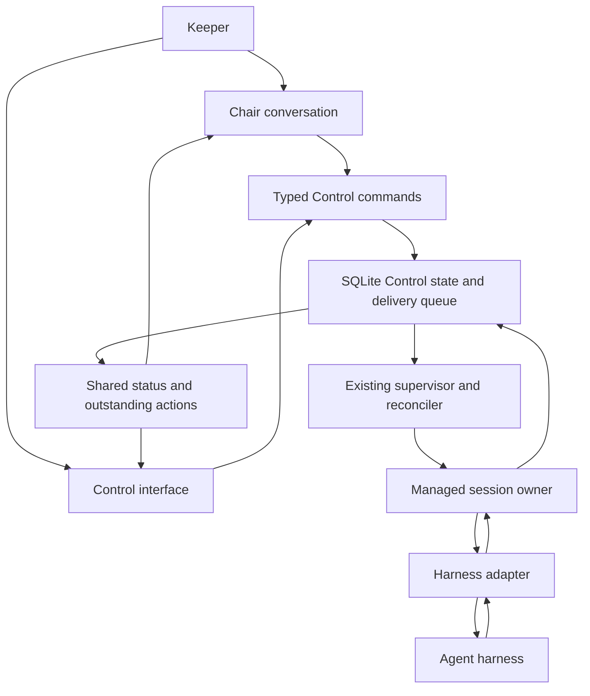

# Managed agent sessions and reliable delivery

Status: proposed implementation plan. This document authorizes no launches or
deployment. Prepared from the current Asha source and the reference implementations
below; provider compatibility still requires local contract tests.

The [Donmai source study](2026-09-07--donmai-runtime-study.md) supplies the detailed
implementation comparison. Asha remains the product and runtime being developed;
Donmai is a design reference, not a proposed dependency or replacement.

## Recommendation

Extend Asha's existing Control supervisor and durable stores with managed session
adapters. Make session events, addressed messages, and explicit outstanding actions
the interface used by the chair, coordinators, workers, and Control. Retain tmux
for interactive Rooms, attachment, and diagnostics.

Use SQLite from the first implementation milestone for operational Control state,
including the durable delivery queue. This follows the Keeper's preference for
transactional storage with indexed queries and search. Keep one local supervisor
and the existing scheduling logic; SQLite is embedded and adds no database service
to operate. Prove one complete conversation-to-work cycle before broad rollout.

The first provider implementation should be Claude, consistent with the Keeper's
current agent preference. Codex follows behind the same contract. Other harnesses
continue to expose their actual supported capabilities rather than simulated
message delivery through their terminal interfaces.

## What exists and where the gap is

| Existing seam | Evidence in Asha | Change needed |
| --- | --- | --- |
| Headless worker launch | `lib/control/harness.py`, `launch.py`; scheduler emits `--headless` | Add structured events and native session identity to the existing launch path. |
| Durable addressed messages | `orchestration/messages.py`; digest-bound reads and acknowledgements | Track runtime submission and consumption separately from the existing explicit read acknowledgement. |
| Coordinator authority | `orchestration/coordinator.py`; pane ancestry, process incarnation, generation fencing | Support a managed session owner with equivalent role and generation proofs. |
| Persistent supervisor | `orchestration/supervisor_daemon.py`; flock ownership and reconciliation loop | Dispatch pending conversation turns and reconcile session delivery independently of the UI. |
| Work scheduling and evidence | `orchestration/scheduler.py`, `results.py`, `seals.py`, `review.py`, `verification.py` | Feed structured session outcomes into these existing transitions. |
| Terminal status fallback | `harness.py` prompt markers and `reconcile.py` pane-tail inspection | Prefer adapter events for managed sessions; label unsupported or uncertain observations honestly. |
| Operator views | `view.py`, `tui.py`, `orchestration/tui_model.py`, chair skills | Derive counts, blockers, questions, and next actions from one shared projection. |

Asha already supports headless Claude and Codex workers. This is not a migration
of every worker from an interactive terminal. The largest missing connection is
between durable coordination records and an idle chair/coordinator's next turn.
Current coordinator and message schemas embed tmux anchors, so changing transport
also requires a versioned identity and authority migration.

## Target arrangement

The supervisor owns scheduling. The session owner owns the live harness connection
and serializes its inputs. A coordinator model decides how to solve assigned work;
ordinary delivery, retries, and status queries do not require another model turn.
An interactive chair may display the resulting status, but its terminal is not a
required relay for coordinator/worker progress.

## Queue, queries, and persistence decision

SQLite is the selected backend, not a fallback. Place its database in the existing
Control state directory derived from `ASHA_HOME`. Keep code, manuscripts, workspaces,
and large immutable evidence artifacts as files; store their identities, paths,
digests, and relationships in the database. Human-readable exports are views of
state, not alternate writable authorities.

| Records | Query and integrity requirements |
| --- | --- |
| Initiatives, nodes, attempts, sessions, turns | Stable IDs, generation and revision checks, indexed project/state lookup. |
| Messages, delivery attempts, receipts | Recipient/state/due-time indexes; unique delivery keys; digest-bound receipts. |
| Outstanding requests and answers | Owner/status indexes and one effective resolution per request. |
| Session and orchestration events | Durable ordered cursors, source-event deduplication, append-only audit operations. |
| Plans, authority decisions, evidence references | Preserve canonical payloads and existing digest semantics; index relationships without rewriting sealed bytes. |

Expose typed store methods and read-only status/search commands. Agents submit
changes through the existing validated Control actions, not unrestricted SQL.
SQL constraints supplement role and authority validation; they do not replace it.
Useful queries include pending questions by project, deliveries overdue for a
session, attempts blocked on quota, and the events leading to a failed review.
Use ordinary indexes for these exact filters. Add FTS5 for message bodies and
human-readable summaries when text search is exposed, with availability checked
by doctor. Keep search indexes rebuildable and out of the authority path.

Use short transactions to claim eligible delivery, check the current generation,
and record its intent together. Commit before contacting the harness, then record
the observed response in another transaction. Never hold a database write lock
while a model runs. The external submission/receipt gap still needs reconciliation;
SQL transactions cannot make an external tool execute exactly once.

Start with WAL mode on local storage, foreign-key enforcement on every connection,
`synchronous=FULL`, a bounded busy timeout, and explicit handling of lock contention.
SQLite admits one writer at a time; this fits the existing single supervisor when
writes are short. Scope database access to trusted controller processes and use
typed IPC for managed actors. Protect the database directory and WAL/SHM sidecars
under the same ownership rules as other Control state. Probe the linked SQLite
version and filesystem support in doctor; do not silently choose weaker durability.

Persist retry times and failure disposition. A local wake signal is an optimization;
the supervisor's indexed scan recovers lost signals. Closing Control does not stop
delivery. Use bounded read snapshots and cursor pagination so historical volume
does not hide live work or pin WAL checkpoints indefinitely.

Provide versioned schema migrations, database health checks, and a tested backup
and restore command using SQLite's backup mechanism. A backup of a live database
must include committed WAL state; copying the main database file alone is not the
backup procedure. Publish external artifacts durably before committing their
references, and reconcile orphan artifacts after interrupted publication.

Redis is outside this plan. Reconsider a network broker only when work must be
coordinated across hosts. SQLite supplies local persistence and queries; the
supervisor and adapters still supply dispatch, wakeup, and consumption evidence.

### Existing-state migration

1. Add the SQLite implementation behind the Control store interfaces. Specify each
   record domain's authoritative backend and keep existing CLI behavior stable.
2. Import a quiescent snapshot into a staging database. Preserve IDs, generations,
   cursor ordering, timestamps, canonical payloads, digests, approvals, and seals.
   Validate row counts, relationships, unresolved work, and representative queries
   against the original snapshot. Malformed records must be reported, not omitted.
3. For each cutover, stop admission and quiesce every affected writer, including
   direct CLI/hook writes. Commit an explicit backend marker only after validation.
   Older binaries must refuse migrated writes. Keep source files as a read-only
   migration snapshot; do not maintain live dual writes.
4. Migrate domains participating in one atomic transition together. Until a domain
   moves, access it through an explicit legacy adapter and use revision-bound,
   idempotent reconciliation across the boundary. Never claim a database transaction
   also committed a legacy file update. Reach one SQLite operational store by rollout.
5. Test interrupted import and interrupted activation. Before new writes, rollback
   can restore the prior backend marker. After new writes, rollback requires a
   validated reverse export or compatible binary; stale source files cannot become
   authoritative again without losing work.

## Contracts to establish

**Identity and ownership.** Keep initiative, node, attempt, and plan identities.
Add a stable Asha session ID, native provider session ID, process incarnation,
controller generation, and per-turn ID. Version the anchor union so legacy tmux
records remain readable. A private local endpoint must prove caller ownership and
scope; environment labels or possession of a session ID confer no authority.
Fence old owners before accepting replacement commands. A model in the chair
does not gain permission to sign approvals just because it has a session handle.

**Harness capabilities.** Define start, resume, observe, stop, and optional steer
and answer-request operations. Probe structured output, native resume, input
delivery, approval response, and reconnect separately. Unsupported operations
return an explicit disposition. Version-pin the tested protocol; preserve Asha
skills, persona by role, project context, sandbox, hooks, and execution policy.
Do not broaden permissions to make unattended execution appear successful.
Capabilities must be declared per execution mode as well as harness version:
interactive PTY output and headless structured events provide different evidence.
Submission returns a turn handle promptly; event consumption runs concurrently.
The contract must not require a follow-up subprocess to exit before its output
can be drained. Recheck role context and permissions on native resume.

**Delivery.** Track `queued`, `submitted`, `consumed`, and `resolved` as distinct
facts with evidence, plus `uncertain`, `failed`, `cancelled`, or `superseded` where
appropriate. Resolution applies to messages requiring an action or reply; an
informational message need not create a task. Existing message acknowledgements
retain their current meaning and are not retrospectively relabelled as consumption.
Link message ID and content digest to the recipient generation and turn.
Record durable custody separately: SQLite may prove that Asha retained a message,
but neither this fact nor an in-memory buffer proves recipient consumption. Use
separate counters for refused delivery attempts and waiting for a running turn.
If withdrawal fails after a timeout, retain an uncertain disposition until native
evidence resolves it; expiry alone cannot prove the message will never arrive.

A successful socket write or exited CLI is not proof of consumption or task
completion. Where the harness cannot provide consumption evidence, report that
limitation. Delivery may be attempted more than once, but duplicate scheduler acts
and resolutions must be idempotent. After a crash between submission and receipt,
query native history when supported; otherwise preserve uncertainty rather than
blindly replaying a potentially side-effecting turn. Do not promise exactly-once
model or tool execution.

**Session events.** Normalize start, progress, waiting, turn completion, failure,
and stop observations with source, sequence, identity, and timestamps. A turn's
completion remains separate from a node passing review and verification. Silence
means no observed output; it does not prove idleness. Account for actual turns and
attempts against existing budgets, including failed or ambiguous submissions.
Separate display text from state-changing events. Text may be batched, but pending
requests, decisions, delivery receipts, failures, and completion must be persisted
before advancing their receipt cursor. On slow consumers use bounded spooling or
explicit overflow failure; never silently drop these events or block the shared
request/reply connection indefinitely. Stop new dispatch if durable event storage
is unavailable and expose the reason. Do not upgrade a missing terminal event to
success because the process exited normally.

**Outstanding actions.** Give each question or approval a request ID, owning
session/turn, subject digest, reason, intended responder, status, and resolution.
Keep plan approval, tool permission, user clarification, and budget amendment
distinct. Bind an answer to the exact request; reject stale or conflicting answers.
Reuse a valid recorded authorization only within its original scope. Ordinary
inbox delivery must never manufacture an approval or force continuation through a
pending human decision.

## Delivery sequence

### 1. Contract fixtures and one observable conversation cycle

Implement the SQLite store, initial operational schema, and validated import for
the record domains used by the first cycle. Add transactional queue claims and
indexed status queries, then the session/adapter boundary and a fake harness that
can emit structured events and inject failures. Extend the supervisor
to drive one pending turn with a minimal JSON status/read surface. Add managed
owner proofs before permitting any coordinator write outside a tmux anchor.

Then implement a Claude adapter using the existing headless launch as the starting
point. Verify the installed harness's structured stream and native resume behavior
with a bounded smoke test during implementation. Queue follow-ups at turn
boundaries initially. Do not depend on waking a dormant interactive CLI via a Stop
hook: that hook may never fire after the message arrives.

**First useful acceptance scenario:** one managed coordinator receives a small
assignment, asks one Asha clarification, becomes idle, consumes the recorded answer,
dispatches one existing headless worker, receives its result, and reports completion
or a specific verification failure. Use one initiative. The UI can be closed
throughout; no screen capture or `send-keys` is needed for coordination. Test Asha
clarification separately from native harness permissions; declare unsupported
native permission handling instead of bypassing it.

**Exit checks:** duplicate wakeups create no duplicate turn; stale generations
cannot write; a failed submission leaves recoverable work; queued and consumed
are distinguishable in JSON status; migrated identities and digests match their
source records; an interrupted import never activates a partial database; concurrent
claims reserve only one delivery; a slow event consumer cannot silently lose the
turn's completion or a question. This is the first implementation milestone,
not merely a storage layer or a dashboard mockup.

### 2. Recovery and complete action handling

Make the session owner a small independently supervised process that can preserve
its live harness connection when the scheduling supervisor restarts. Use local
IPC and generation fencing; integrate with existing service lifecycle commands.
Keep this narrower than Donmai's full interactive terminal replay implementation.

On startup, reconcile existing owners and occupied capacity before dispatching.
Persist bounded event output and the acknowledged cursor. Missing output history
must produce a visible gap, not a fabricated reconstruction. If the owner itself
dies, distinguish native session resume from reattaching to a still-running turn;
never infer the latter from a saved session ID.

Connect approval and question resolution to the same durable action projection.
Handle quota exhaustion, provider failure, cancellation, and uncertain delivery
without replacing the initiative. Separate transport retries from new model turns
and review attempts. Add a narrow explicit budget amendment for retrying an exact
sealed review when the current budget is exhausted; preserve the seal, scope, and
recorded approval history. Evidence reuse requires matching relevant inputs and
environment, not merely matching the command string.

**Exit checks:** supervisor restart preserves the live owner and pending question;
old controllers are fenced; duplicate answers do not resume twice; quota failure
parks with a reason and recovery condition; ambiguous native submission does not
automatically run twice; termination targets only the proven session owner/group.

### 3. Chair and Control consume the same state

Build one projection for sessions, actionable tasks, messages awaiting delivery,
and unresolved requests. Distinguish work waiting on the Keeper, another agent,
provider availability, or failed observation. Show the responsible actor and next
permitted action. Reuse Current/All navigation and preserve completeness reporting.

At chair startup, render a deterministic summary such as: “5 rooms, 2 active tasks,
1 question for you.” Show age and reason for stalled work. Answer through either
chair or Control using the same request ID. Explicit supervisor pause/drain/stop
state must explain whether closing a UI leaves background work running.

Update canonical chair/coordinator instructions and render them through the
installer. Instructions should call the implemented interfaces rather than create
a second polling protocol. For harnesses whose interactive chair cannot accept
automatic delivery, expose the supported read surface and label that limitation;
offer a managed chair presentation only after input ownership is tested.

**Exit checks:** chair and Control show the same unresolved request count; resolving
a request in one clears it in the other; terminal resizes cannot change machine
state; an unavailable adapter is not displayed as idle; no periodic status update
requires a model invocation.

### 4. Additional adapters and default rollout

Implement the Codex adapter against the documented app-server session/turn event
and approval protocol, first verifying the installed version and Asha launch
environment. Prefer a private local connection; isolate differently authorized
roles into separate processes initially. Do not multiplex incompatible permissions
or environments just to reduce process count.

Keep Claude the default for newly assigned agents under the current preference.
Audit Copilot and OpenCode for their own native interfaces and declare capability
limits until each adapter passes the same tests. Roll out managed coordination
per harness and role; existing Rooms and historical tmux anchors remain valid.

**Exit checks:** each advertised capability has a passing contract test; role
instructions and enforcement surfaces survive installation; supported managed
cycles need no screen parsing; legacy Room attach/close and unsupported-harness
behavior remain accurate. Make managed coordination the default only after the
failure-injection scenarios and a bounded real task pass.

## Verification and rollout controls

Use deterministic fake providers for crash, timeout, duplicate, stale-answer,
out-of-order event, missing receipt, owner replacement, and quota scenarios. Add
database tests for transaction rollback, lock contention, foreign-key enforcement,
query pagination, interrupted cutover, backup/restore with committed WAL content,
and storage exhaustion. Check indexed query plans against a representative retained
history fixture so active-work lookup does not become another full registry scan.
Add real harness tests only at the provider seams, bounded by an explicit turn budget.
Record dispatch latency, ambiguous deliveries, duplicate execution, coordinator
turn count, repeated approval count, and manual terminal interventions.

Targets: local eligible-work dispatch within two supervisor ticks under the test
load; zero lost pending messages; zero duplicate task dispatches in injected-failure
tests; zero repeated approval requests for an unchanged valid authorization; zero
terminal interventions on the supported acceptance path. Measure provider latency
separately from scheduler latency.

Run narrow changed tests first. Before landing cross-harness installer changes,
run `./tests/run-tests.sh` and the required Codex/OpenCode drift checks for affected
targets. Include doctor capability reporting and legacy-record fixtures.

Use one umbrella work item with the four milestones above and one active
implementation slice. A discovered failure should normally repair the current
slice or enter its backlog, not create another initiative. Estimate remaining
effort after milestone 1 demonstrates the actual installed provider behavior.

Transport rollback switches new dispatches back to a compatible legacy launch path
after draining or safely parking managed sessions. It retains SQLite as the
authoritative store; storage rollback follows the migration rules above. Keep
session records and schema readers. Never launch a legacy duplicate while ownership
or submission of a managed turn is uncertain.

## Reference basis

The source study qualifies these references: Donmai acknowledges some headless
injects on buffering, its Codex event channel can drop output under pressure, and
its inspected approval bridge makes local policy decisions rather than persisting
human questions. Borrow explicit interfaces and evidence distinctions without
assuming uniform delivery, restart, or approval guarantees across its run modes.

- [Donmai session handle](https://github.com/RenseiAI/donmai/blob/6250f7aa71f41a0a6222d000d23664a2a782bfec/agent/handle.go)
  and [delivery implementation](https://github.com/RenseiAI/donmai/blob/6250f7aa71f41a0a6222d000d23664a2a782bfec/runner/interactive_inject.go):
  capability-based delivery and distinguishing offers from consumption.
- [Donmai session ownership](https://github.com/RenseiAI/donmai/blob/6250f7aa71f41a0a6222d000d23664a2a782bfec/sessionshim/doc.go):
  independently owned sessions and controller replacement. Borrow the separation,
  not the entire terminal transport stack.
- [Munder Difflin mail router](https://github.com/chaitanyagiri/munder-difflin/blob/3e4f9f62a0f219b45f6428fd62f1a8a546d0f607/src/main/hive.ts)
  and [wake watchdog](https://github.com/chaitanyagiri/munder-difflin/blob/3e4f9f62a0f219b45f6428fd62f1a8a546d0f607/src/main/workerWake.ts):
  useful mailbox separation, with continuing dependence on terminal delivery.
- [Official Codex app-server documentation](https://learn.chatgpt.com/docs/app-server):
  structured threads, turns, streamed events, and request-bound approval responses.
- [SQLite WAL documentation](https://www.sqlite.org/wal.html),
  [FTS5](https://www.sqlite.org/fts5.html), and
  [backup API](https://www.sqlite.org/backup.html): concurrency, optional text search,
  and consistent live backups. SQLite is the selected local operational backend.

The reference repositories were inspected as source, not executed or certified.
The proposed contracts and rollout decisions above are recommendations for Asha.
